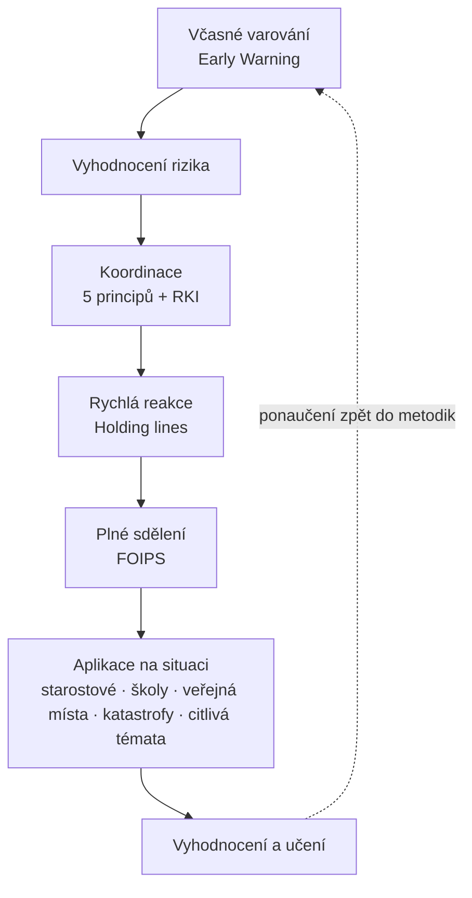

# Metodiky a návody

Otevřená knihovna postupů pro akutní a krizovou komunikaci. Jádro vzniklo v oddělení strategické komunikace Ministerstva vnitra ČR (2022 až 2026); dále knihovnu rozvíjí a publikuje **[Institut KRIT](https://www.krit.institute)**. Metodiky vznikly z reálných incidentů – povodní 2024, střelby na FF UK, incidentů AMOK, bombových výhrůžek školám, výpadku proudu 2025 – a průběžně je aktualizujeme podle nových zkušeností.

Jsou určeny starostům, mluvčím, ředitelům škol, krizovým manažerům, příslušníkům IZS i všem, kdo se podílejí na komunikaci s veřejností v napjatých situacích.

**Metodiky se drží platné legislativy krizového řízení, ale nenahrazují ji.** Zákonné povinnosti – varování obyvatelstva a tísňové informace, pravomoci velitele zásahu, role obcí a složek IZS – mají vlastní režim, který má vždy přednost; postupy v knihovně na něj navazují a doplňují ho o komunikační vrstvu. Kde jsou metodiky přísnější než zákon (například první sdělení do 30 minut), jde o standard systému, ne o zákonnou povinnost.

> [!info] Licence
> Materiály jsou volně dostupné pod licencí **Creative Commons BY 4.0** – můžete je používat, šířit a upravovat s uvedením zdroje.

---

## Jak systém funguje

Metodiky nejsou samostatné dokumenty vedle sebe – jsou to části jednoho postupu. Když se objeví riziko, systém jím prochází v pořadí: nejdřív ho zachytí, pak vyhodnotí a začne koordinovat, formuluje sdělení a aplikuje ho na konkrétní situaci. Po odeznění událost systém vyhodnotí a ponaučení vrátí zpět do metodik.

Každý krok na mapě má níže svou metodiku. Jak celý řetězec vypadal na jedné reálné události, ukazuje [[Případová studie – Povodně 2024|případová studie z povodní 2024]].

---

## Kudy do systému

Tři cesty podle toho, kdo jste:

1. **Jsem starosta nebo pracuji v samosprávě.** Začněte u [[O kartách pro starosty|Karet pro starosty]] – hotové karty pro konkrétní typy událostí. Širší kontext dává [[Ohrožení veřejných míst|Ohrožení veřejných míst]]. Pro povodně, rozsáhlé výpadky elektřiny a další velké události slouží [[Katastrofické mimořádné události|Katastrofické mimořádné události]]. Pro napětí kolem sociálních témat (soužití, ubytovny, dávky) slouží [[Sociálně citlivá témata|Sociálně citlivá témata]].
2. **Jsem mluvčí, ředitel školy nebo provozovatel měkkého cíle.** Podívejte se na [[Ohrožení veřejných míst|Ohrožení veřejných míst]] a [[Bombová výhrůžka ve škole|Bombová výhrůžka ve škole]] a osvojte si nástroje [[Rámec pro krizová sdělení (FOIPS)|FOIPS]], [[Holding lines|Holding lines]] a [[Rodná karta incidentu (RKI)|Rodnou kartu incidentu]].
3. **Chci pochopit celý systém.** Začněte u [[Jak přemýšlíme o krizích|Jak přemýšlíme o krizích]], pak projděte [[Akutní komunikace|Akutní komunikace]], [[Principy koordinace|Principy koordinace]] a [[Systém včasného varování|Systém včasného varování]], pak jednotlivé nástroje. Slovníček [[Pojmy a zkratky|Pojmy a zkratky]] mějte po ruce.

---

## Začněte zde

Pokud se s metodikami seznamujete poprvé, doporučujeme začít od východisek a konceptuálního rámce a postupovat k jednotlivým nástrojům a aplikacím.

- **[[Jak přemýšlíme o krizích|Jak přemýšlíme o krizích]]** – přesvědčení, na kterých všechny metodiky stojí. Proč krize zvládáme, místo abychom je poráželi, a proč je komunikace státu veřejná služba, ne PR. Nejlepší první čtení.
- **[[Akutní komunikace|Akutní komunikace]]** – co je akutní komunikace, jak se liší od krizové komunikace ve smyslu zákona `č. 239/2000 Sb.` a v jakých situacích systém nastupuje. Vstupní text, který drží celý rámec pohromadě.
- **[[Pojmy a zkratky|Pojmy a zkratky]]** – slovníček pojmů a rozpad zkratek. Užitečný společník ke všem ostatním stránkám.

---

## Systémový rámec

Jak je celý systém uspořádaný a podle čeho rozhoduje.

- **[[Principy koordinace|Principy koordinace]]** – organizační páteř systému: blízkost, zodpovědnost, kontinuita, rychlost, koordinace. Princip, ze kterého vychází každý další nástroj.
- **[[Systém včasného varování|Systém včasného varování]]** – detekční vrstva, která rozpozná riziko dřív, než se z něj stane krize. Vstupy a signály.
- **[[Vyhodnocení po incidentu|Vyhodnocení po incidentu]]** – uzavření smyčky učení: jak po odeznění události vyhodnotit komunikaci a vrátit poznatky do metodik a karet.

---

## Komunikační rámec a nástroje

Konkrétní techniky, které se používají při samotné komunikaci.

- **[[Rámec pro krizová sdělení (FOIPS)|Rámec pro krizová sdělení (FOIPS)]]** – pětiprvkový kontrolní seznam (Fakta, Opatření, Instrukce, Podpora, Směr), kterým by mělo projít každé krizové sdělení. Vznikl v oddělení strategické komunikace Ministerstva vnitra ČR; formovaly ho zkušenosti ze střelby na FF UK a dalších incidentů.
- **[[Holding lines|Holding lines]]** – předem připravené formule pro situaci, kdy je nutné komunikovat, ale ještě nejsou ověřená fakta. Drží pozici beze spekulací.
- **[[Rodná karta incidentu (RKI)|Rodná karta incidentu (RKI)]]** – sdílený živý dokument, který drží všechny zapojené složky (IZS, policii, samosprávu, ministerstva) v jednom aktuálním obrazu situace.

---

## Aplikace na konkrétní situace

Návody pro typové situace, kde se obecné principy převádějí do konkrétních kroků a vzorových formulací.

- **[[O kartách pro starosty|Karty pro starosty (KPS)]]** – sada karet pro obce: pro každý typ mimořádné události úkoly starosty, komunikační doporučení a kontakty.
- **[[Katastrofické mimořádné události|Katastrofické mimořádné události]]** – povodně, rozsáhlé výpadky elektřiny, průmyslové havárie. Jak komunikovat, když selhává infrastruktura, na které komunikace stojí: odolné kanály a tři fáze komunikace – před, během, po.
- **[[Ohrožení veřejných míst|Ohrožení veřejných míst]]** – nákupní centra, dopravní uzly, kulturní akce, úřady. Co dělat při bombové výhrůžce, hrozbě útoku, evakuaci.
- **[[Bombová výhrůžka ve škole|Bombová výhrůžka ve škole]]** – specifický návod pro ředitele a vedení škol, vycházející ze série bombových výhrůžek školám z roku 2024.
- **[[Sociálně citlivá témata|Sociálně citlivá témata]]** – dávky, sociální služby, exekuce, integrace. Jak komunikovat preventivně i za eskalace tak, aby se z věcného problému nestal zdroj napětí, stigmatizace a polarizace.

---

## Ukázka v praxi

- **[[Případová studie – Povodně 2024|Případová studie – Povodně 2024]]** – celý systém krok za krokem na jedné reálné události: od preventivní přípravy přes koordinaci a RKI po práci s dezinformacemi a předání koordinace.

---

## Jak metodiky vznikají

Postupy stavíme na praxi a opíráme se o vědecké poznatky o komunikaci rizik. Každý významný incident – povodně 2024, střelba na FF UK (2023), útok chladnou zbraní v OC Futurum v Hradci Králové (2026), AMOK OÚ Chřibská (2026), požár průmyslové haly Pardubice (2026), výpadek proudu 2025 – končí případovou studií, ze které vychází aktualizace metodik. Jak takové vyhodnocení vypadá, popisuje [[Vyhodnocení po incidentu|Vyhodnocení po incidentu]]. Doplňujeme je dlouhodobou řadou sociologického výzkumu (8 vln, více než 9 600 respondentů) a konzultacemi s akademickou obcí i zahraničními partnery.

Pokud najdete chybu nebo máte doplnění, napište nám na [hello@krit.institute](mailto:hello@krit.institute).

---

## Související odkazy

- **[krit.institute](https://www.krit.institute)** – web Institutu KRIT (kdo jsme, čemu se věnujeme, jak spolupracovat)
- **[Akademie akutní komunikace](https://www.krit.institute/)** – školení pro samosprávy, školy, mluvčí a krizové manažery
- **Kontakt**: [hello@krit.institute](mailto:hello@krit.institute) · +420 777 313 425

<!-- last-updated:start -->

---

*Poslední aktualizace: 2. září 2026*

<!-- last-updated:end -->

<!-- license:start -->

*© KRIT – Institut pro krizovou komunikaci, 2026 · [www.krit.institute](https://www.krit.institute). Text je dostupný pod licencí CC BY 4.0 – používejte, šiřte a upravujte s uvedením zdroje.*

<!-- license:end -->
