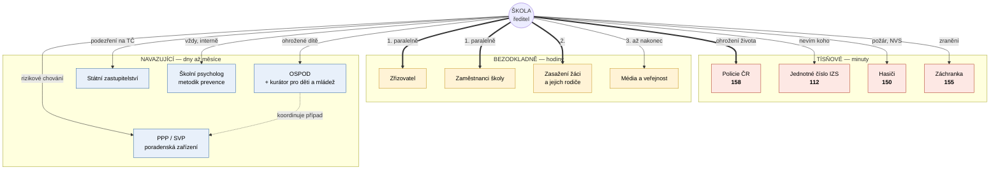

# Mapa aktérů — kam se obrátit, kdy a s čím

Kdo je kdo v okolí školy, v jaké fázi vstupuje do hry a co po škole potřebuje.
Každý řádek má odkaz na místo v korpusu, odkud pochází — **nic tu není
domyšlené**. Kde korpus mlčí, je to napsané.

> **V ohrožení života volejte 158 nebo 112. Tenhle dokument nenahrazuje
> tísňovou linku.** AMOK 4 to říká verzálkami a má pravdu.

---

## 1. Přehled

**Dvě pravidla, která z korpusu vystupují nejsilněji:**

1. **Napřed dovnitř, potom ven.** KRIT: *„Nejprve komunikujte interně — žáci,
   rodiče, školní personál a zřizovatel by se neměli dozvědět informace
   o incidentu z médií, teprve poté komunikujte externě."*
2. **Raději dřív než pozdě.** AMOK 3: *„Raději oznámit vícekrát než jednou
   pozdě."*

---

## 2. Tísňové složky

| Komu | Kdy | S čím | Zdroj |
| --- | --- | --- | --- |
| **Policie ČR — 158** | Ohrožení života, aktivní útočník, zbraň ve škole, výhrůžka | Kde, co se děje, kolik osob, popis pachatele. Lze i **SMS**. | [AMOK 4](../data/03-krizova-reakce/amok-04-okamzita-reakce-na-utok.md) |
| **Policie ČR — 158** | Varovné signály a výhrůžky — **neprodleně**, i bez útoku | Konkrétní jednání. KRIT varuje: *„nestačí říci, že se nám žák X,Y nějak nezdá / chová se divně"* | [KRIT](../data/03-krizova-reakce/krit-akutni-komunikace-ve-skolnim-prostredi.md) |
| **IZS — 112** | Když nevíte, která složka, nebo je jich potřeba víc | Totéž | [příloha 1](../data/01-ramec-a-legislativa/priloha-01-terminologie.md) |
| **HZS — 150** | Požár, nález nebo oznámení o uložení NVS, havárie | Evakuace | [příloha 8](../data/04-po-krizi-a-navrat/priloha-08-koordinacni-plan.md) |
| **ZZS — 155** | Zranění | Počet a stav zraněných | [příloha 11](../data/03-krizova-reakce/priloha-11-karta-skoly-izs.md) |

Pro velitele zásahu má škola připravenou **Kartu školy pro součinnost se
složkami IZS** — aktuální počty osob v objektu, plány, klíčový režim.
Nepřipravuje se v krizi, připravuje se předem.

---

## 3. Uvnitř školy a zřizovatel

| Komu | Kdy | S čím | Zdroj |
| --- | --- | --- | --- |
| **Zaměstnanci školy** | Souběžně se zřizovatelem, hned po IZS | Co se stalo, co dělat, kdo mluví s médii | [KRIT](../data/03-krizova-reakce/krit-akutni-komunikace-ve-skolnim-prostredi.md) |
| **Zřizovatel** | Souběžně se zaměstnanci | Totéž + co škola potřebuje | [KRIT](../data/03-krizova-reakce/krit-akutni-komunikace-ve-skolnim-prostredi.md) |
| **Zasažení žáci a rodiče** | Hned po interním kruhu, **před médii** | První oznámení do 30 minut — KRIT má vzorové formulace | [KRIT](../data/03-krizova-reakce/krit-akutni-komunikace-ve-skolnim-prostredi.md) |
| **Ostatní rodiče** | Po zasažených | Průběžná aktualizace do 2 hodin | [KRIT](../data/03-krizova-reakce/krit-akutni-komunikace-ve-skolnim-prostredi.md) |
| **Média** | Až nakonec | Komplexnější vyjádření do 24 hodin | [KRIT](../data/03-krizova-reakce/krit-akutni-komunikace-ve-skolnim-prostredi.md) |
| **Školní psycholog, metodik prevence** | Při každém signálu | Sdílení v týmu — vedení, metodik, poradna | [AMOK 2](../data/02-prevence-a-priprava/amok-02-skoly-signaly-detekce-hodnoceni-reakce.md) |

---

## 4. Navazující instituce

| Komu | Kdy | S čím | Zdroj |
| --- | --- | --- | --- |
| **OSPOD** | Ohrožené dítě; **při bagatelizaci či nespolupráci rodičů** | Popis situace, co škola už udělala, co potřebuje | [AMOK 1](../data/02-prevence-a-priprava/amok-01-prevence-a-pripravenost.md), [AMOK 7](../data/03-krizova-reakce/amok-07-podezreni-na-zbran-ve-skole.md) |
| **OSPOD** | Po incidentu — postoupení záznamu | Formulář *Záznam o bezpečnostním incidentu* | [příloha 5](../data/04-po-krizi-a-navrat/priloha-05-evidence-bezpecnostnich-incidentu.md) |
| **Kurátor pro děti a mládež** (pracoviště OSPOD) | Navazující práce s dítětem | Kurátor je **koordinátorem případu**, síťuje služby | [MPSV](../data/04-po-krizi-a-navrat/mpsv-metodicka-prirucka-pro-kuratory.md) |
| **Státní zastupitelství** | Okolnosti nasvědčují spáchání trestného činu | Oznámení. Korpus: *„je každý povinen učinit oznámení Policii ČR nebo státnímu zastupitelství"* | [příloha 5](../data/04-po-krizi-a-navrat/priloha-05-evidence-bezpecnostnich-incidentu.md) |
| **Státní zastupitelství** | V odůvodněných případech vedle OSPOD | Korpus odkazuje na § 31 odst. 3 a 5 školského zákona | [AMOK 2](../data/02-prevence-a-priprava/amok-02-skoly-signaly-detekce-hodnoceni-reakce.md) |
| **PPP / SVP** | Rizikové chování, potřeba odborného posouzení | Popis projevů, co škola zkusila | [AMOK 1](../data/02-prevence-a-priprava/amok-01-prevence-a-pripravenost.md), [AMOK 11](../data/01-ramec-a-legislativa/amok-11-nejcastejsi-dotazy.md) |

Korpus opakovaně tlačí na **multidisciplinární postup** — AMOK 11: *„Konzultovat
multidisciplinárně a meziinstitucionálně (rodič, PPP, OSPOD, PČR)."* Žádný
z aktérů nemá případ řešit sám.

---

## 5. Co v korpusu chybí

Poctivě: tahle mapa má díry, protože je mají zdrojová data.

- **Přesné právní podmínky, kdy vzniká oznamovací povinnost.** Korpus na ně
  odkazuje (§ 31 školského zákona, trestní zákoník), ale
  **zákon č. 359/1999 Sb., o sociálně-právní ochraně dětí, v korpusu není.**
  Aplikace proto nesmí tvrdit „musíte oznámit" — může říct „tohle je situace,
  kde se oznámení zvažuje, ověřte si to".
- **Krizová intervence a následná péče.** Kdo poskytuje, jak se objednává,
  kdo platí — nikde. Chybějící dokument *Škola a neštěstí: Jsme připraveni!*
  míří přesně sem.
- **ČŠI, MŠMT a kraj** jako adresáti hlášení: korpus je nezmiňuje v roli
  příjemce oznámení o incidentu.
- **Konkrétní kontakty.** Korpus je celostátní; místní OSPOD, PPP a zřizovatele
  si musí každá škola doplnit sama. V aplikaci to je pole, které si škola
  vyplní jednou — viz [`navrh-aplikace.md`](navrh-aplikace.md).
