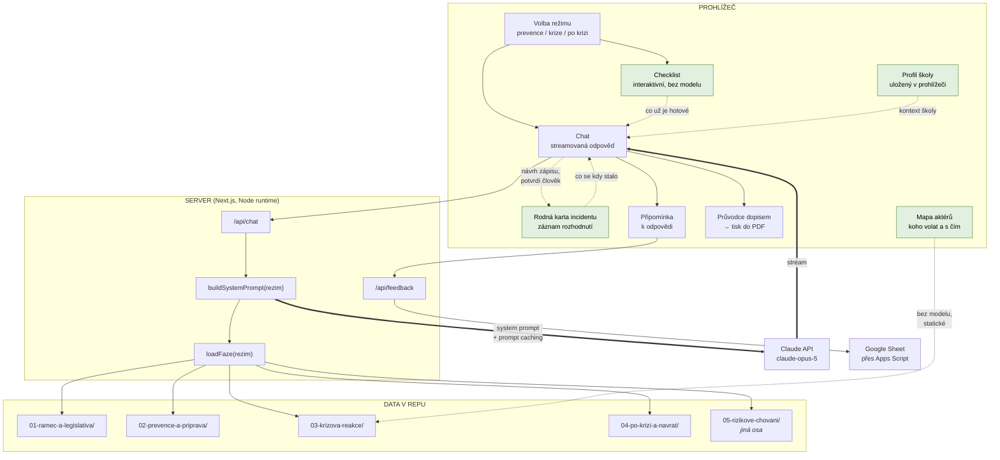
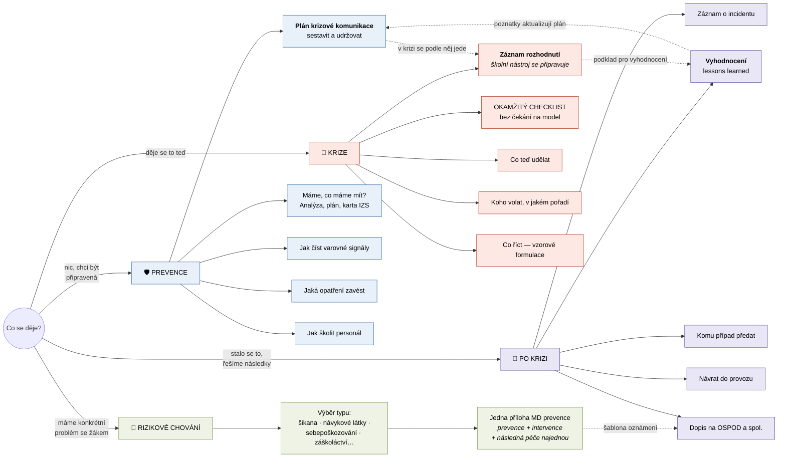
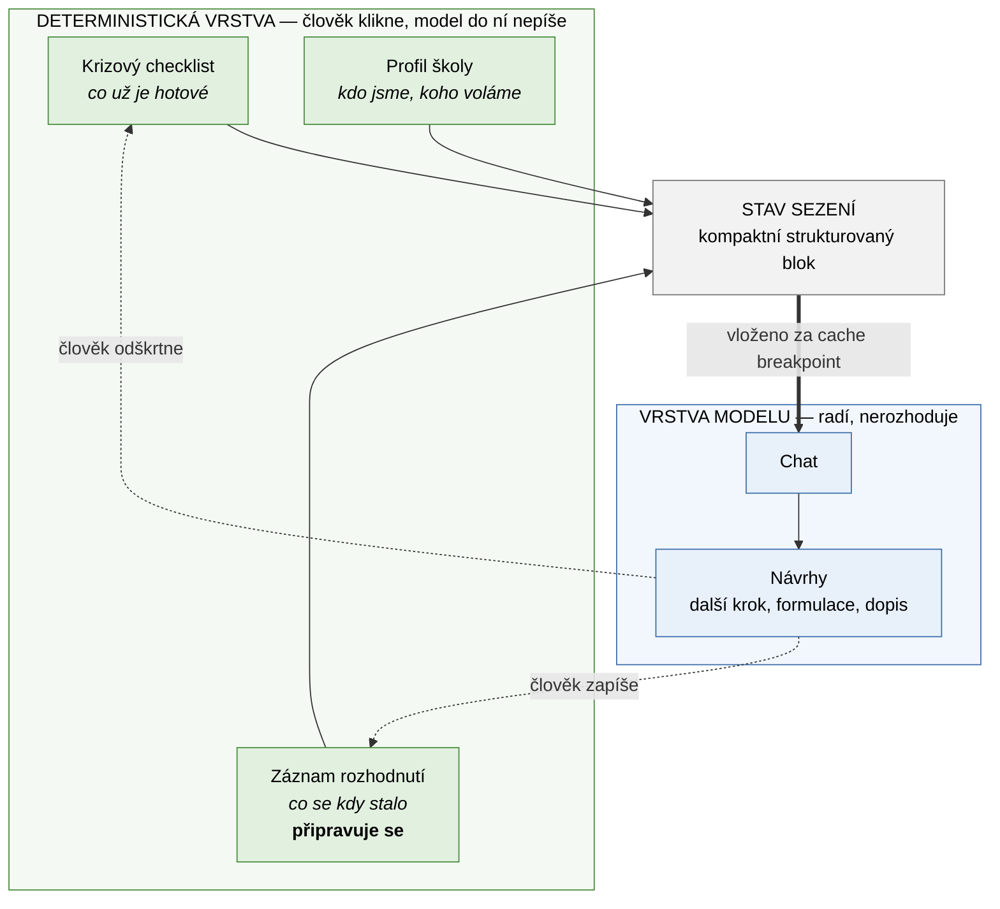
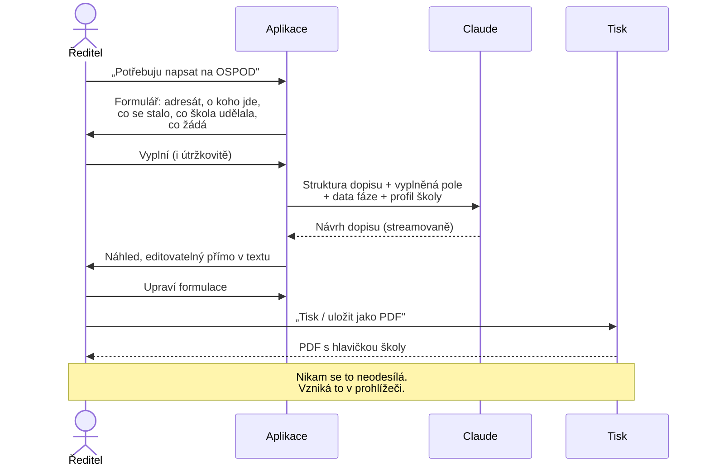
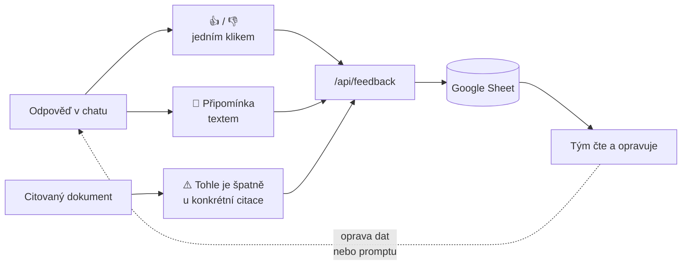

# Návrh chatovací aplikace — Bezpečná škola

Návrh nástroje pro ředitele a vedení škol postaveného nad korpusem
v [`data/`](../data/). Vychází ze stejného vzoru jako
[Katalog podpůrných opatření](https://github.com/aidetemcz/podpurna-opatreni):
Next.js, Anthropic SDK, deterministické vložení dat do promptu, panel
připomínek. Tenhle dokument je **návrh, ne popis hotové věci** — nic z toho
zatím není naimplementované.

---

## 1. Co to má být

Ředitel má na stole 150 stran metodik od pěti různých vydavatelů. Ve chvíli,
kdy je potřebuje, na ně nemá čas. Aplikace má z korpusu udělat **odpověď na
konkrétní otázku konkrétní školy** — a když je potřeba, rovnou i dopis.

**Co to není:** není to tísňová linka a není to právní poradna. Obojí musí být
v UI vidět, ne schované v patičce.

---

## 2. Architektura



**Klíčové rozhodnutí: žádné RAG, žádné embeddingy.** Volba režimu = pevně daný
obsah. Je to levnější, rychlejší a hlavně **předvídatelné** — u bezpečnostních
postupů nechceme, aby vyhledávač někdy nenašel to podstatné.

Korpus ale vyrostl na **~616 000 tokenů** a celý se do promptu nevejde — po
doplnění v září 2026 se tam **nevejde ani jedna celá fáze**. Návrh proto pracuje
ve třech vrstvách:

| Vrstva | Co obsahuje | Velikost | Jak se dostane k modelu |
| --- | --- | ---: | --- |
| **Jádro** | Minimální standard, terminologie, legislativa, dokumentace, pojmy a principy KRIT — 6 souborů | ~10 000 | Vždy, `cache_control` |
| **Zvolený kontext** | Obsah zvolené fáze, nebo jedna příloha z `05` | 16–69 000 | Deterministicky podle volby, `cache_control` |
| **Na vyžádání** | Zákon 359/1999, 20 karet pro starosty, dlouhé brožury MV, ostatní přílohy | zbytek | Nástroj `precti_dokument(cesta)`, model dostane rejstřík |

Do třetí vrstvy patří hlavně **text zákona (~90 000 tokenů)** a **složka `05`
(~260 000 tokenů)**: ředitel z nich potřebuje vždycky jen kousek. Model dostane
rejstřík (názvy částí, paragrafů, karet, typů rizikového chování) a dočte si to,
co je potřeba. Stejný princip jako „agentické dočítání" v Katalogu podpůrných
opatření.

> **Co se změnilo od minulé verze návrhu.** Původně stačily dvě vrstvy a celá
> fáze se vkládala najednou. Korpus se od té doby ztrojnásobil, takže i uvnitř
> fáze je potřeba vybírat. Princip zůstává — deterministický výběr, ne RAG —
> jen se výběr zjemnil.

---

## 3. Tři režimy



### Rizikové chování je druhá osa, ne čtvrtá fáze

První tři vstupy se ptají **„kdy"**. Čtvrtý se ptá **„co"** — a to je jiná
otázka. Metodické doporučení k primární prevenci je tříděné podle typu
rizikového chování a každá jeho příloha obsahuje prevenci, intervenci
i následnou péči k jednomu typu najednou. Rozřezat ji na fáze by znamenalo
rozbít dokument, který dává smysl jen vcelku.

Proto má aplikace **dvě osy vstupu**: časovou (co se děje teď) a věcnou (jaký
problém řešíme). Ředitel, který přijde s „máme ve třídě šikanu", nepotřebuje
vybírat fázi — potřebuje přílohu č. 6 celou.

Prakticky to znamená, že složka `05` **není dosažitelná volbou režimu** a musí
mít vlastní rozcestník: seznam typů rizikového chování, kde jedna položka = jedna
příloha. Jedna se do promptu pohodlně vejde (medián ~6 000 tokenů, největší
~28 000), celá složka ne (~260 000).

Přerušovaná šipka k dopisům je tam schválně: přílohy nesou i **šablony oznámení
na OSPOD a na PČR**, což je přesně to, co má umět průvodce dopisem (kapitola 5).

---

Tři zvýrazněné uzly a přerušované šipky tvoří **komunikační páteř aplikace**:
plán se sestaví v klidu, v krizi se podle něj jede a průběžně se zapisují
rozhodnutí, po krizi se ze záznamu udělá vyhodnocení a to zpětně změní plán.

> **Prostřední článek zatím nemáme.** Metodika KRIT má pro tuhle roli
> [Rodnou kartu incidentu](../data/03-krizova-reakce/Rodn%C3%A1%20karta%20incidentu%20%28RKI%29.md),
> jenže to je **interní koordinační nástroj KRIT** pro souhru IZS, policie,
> samosprávy a ministerstev — ne dokument, který vede ředitel školy. Školní
> obdoba se teprve připravuje a doplní se sem, až bude. Do té doby RKI slouží
> jako **předloha struktury** (chronologický log, časové razítko a autor
> u každého zápisu, nic se nemaže, opravy jako nový záznam), ne jako nástroj,
> ke kterému by aplikace ředitele posílala.

| Vstup | V promptu | Tokenů | Dočítá si | Chování modelu |
| --- | --- | ---: | --- | --- |
| **Prevence** | jádro + celé `02` | ~69 000 | zákon, brožury MV v plném znění | Ptá se na kontext školy, navrhuje postup, umí vygenerovat osnovu dokumentu |
| **Krize** | jádro + `03` bez karet | ~49 000 | karta pro starosty podle typu události | Krátké odpovědi, odrážky, žádné úvody. Vždy začíná linkou 158 |
| **Po krizi** | jádro + `04` bez *Škola a neštěstí* | ~36 000 | *Škola a neštěstí* (~52 000), zákon, MPSV | Klidný tón, navigace k lidem, příprava dokumentů |
| **Rizikové chování** | jádro + **jedna příloha** z `05` | 16–38 000 | ostatní přílohy, šablony, karty | Podle typu problému; provází intervencí i následnou péčí |

**Jádro** je šest souborů — minimální standard, terminologie, legislativa,
dokumentace a pojmy a principy KRIT. Zákon i dlouhé brožury zůstávají mimo
a čtou se na vyžádání.

> **Výjimky z pravidla „složka = režim".** Dva soubory patří do dvou míst.
> [`skola-a-nestesti-jsme-pripraveni.md`](../data/04-po-krizi-a-navrat/skola-a-nestesti-jsme-pripraveni.md)
> leží ve `04`, ale velká část je příprava — patří i do prevence. A příručka
> [`krit-akutni-komunikace-ve-skolnim-prostredi.md`](../data/03-krizova-reakce/krit-akutni-komunikace-ve-skolnim-prostredi.md)
> leží v krizové složce podle svého názvu, ale celá jedna její třetina je
> prevence — *„Tvorba krizového komunikačního plánu, pravidelná cvičení
> a simulace, budování vztahů s klíčovými partnery, příprava zaměstnanců"*.
> Režim **prevence si obě načítá také.** Když jsou takové soubory dva, je čas
> zavést v hlavičce pole `faze: [...]` se seznamem, místo aby se výjimky
> udržovaly v kódu nebo se soubory řezaly.

### Krizový režim se chová jinak než chat

Tohle je nejdůležitější věc v celém návrhu. **Když se něco děje, streamovaná
odpověď jazykového modelu je špatné UI.** Ředitel nemá deset vteřin.

Proto krizový režim otevírá **statický checklist**, který se vykreslí okamžitě
a je vytažený přímo z [AMOK 4](../data/03-krizova-reakce/amok-04-okamzita-reakce-na-utok.md)
a [AMOK 9](../data/03-krizova-reakce/amok-09-obecna-doporuceni.md) — žádné volání
API, žádné čekání:

```
┌──────────────────────────────────────────┐
│  📞  158        VOLAT / POSLAT SMS       │  ← velké, první, vždy
├──────────────────────────────────────────┤
│  □ Vyhlásit lockdown / evakuaci          │
│  □ Informovat ostatní zvoleným kanálem   │
│  □ Zamknout, zatemnit, zabarikádovat     │
│  □ Sečíst osoby                          │
│  □ Informovat zřizovatele a zaměstnance  │
└──────────────────────────────────────────┘
       ↓ teprve pod tím
   [ Chat: „popište situaci…" ]
```

Chat je v krizovém režimu **doplněk**, ne hlavní věc.

---

## 4. Kde je chatbot a kde ne

Ne všechno v aplikaci má být rozhovor. Některé plochy musí být **deterministické**
— okamžité, stejné pokaždé, funkční i bez sítě. Jazykový model je od toho, aby
radil a psal návrhy, ne aby vedl záznam.

**Pravidlo, které to celé drží:** *model radí, člověk rozhoduje a zapisuje.*
Cokoliv, z čeho vzniká záznam s důkazní nebo úřední hodnotou — Rodná karta
incidentu, dopis na OSPOD, odškrtnutá položka checklistu — vyplňuje člověk.
Model smí předepsat návrh, nikdy ne potvrdit za uživatele.

| Plocha | Typ | Proč tak |
| --- | --- | --- |
| **Krizový checklist** | interaktivní, bez modelu | Musí naskočit okamžitě a fungovat i bez sítě. Odškrtnutí je rozhodnutí člověka. |
| **Mapa aktérů** | statická data + filtr | Referenční tabulka. Telefonní číslo se nemá generovat. |
| **Záznam rozhodnutí v krizi** *(připravuje se)* | formulář s časovými razítky | Chronologický záznam. Model do něj nesmí psát sám. Školní nástroj zatím neexistuje — viz kapitola 3. |
| **Profil školy** | formulář | Vyplní se jednou, drží se v prohlížeči. |
| **Tisk do PDF** | prohlížeč | Žádný model, žádný server. |
| **Chat — prevence** | model | Otevřené otázky, návrhy postupu, osnovy dokumentů. |
| **Chat — krize** | model, **druhotný** | Až pod checklistem. Doplňuje ho, nenahrazuje. |
| **Chat — po krizi** | model | Klidný průvodce, navigace k lidem. |
| **Průvodce dopisem** | formulář → model → editace | Model píše návrh, člověk ho upravuje a tiskne. |
| **Osnova plánu krizové komunikace** | formulář → model | Model složí osnovu z metodik, škola ji vyplní. |
| **Vyhodnocení (lessons learned)** | model nad záznamem | Model čte záznam a navrhne strukturu vyhodnocení. |

### Jak interaktivní plochy ovlivňují chat

Checklist a Rodná karta nejsou jen zobrazení — jsou to **zdroje kontextu**.
Když ředitel odškrtne „Policie ČR informována", chat to musí vědět a přestat mu
to radit.



Stav sezení jde do promptu jako krátký blok — desítky tokenů, ne tisíce:

```
STAV ŠKOLY: ZŠ Příkladná, Praha 6 · zřizovatel MČ Praha 6 · 412 žáků
REŽIM: krize · začátek 10:42
HOTOVO: 158 volána (10:44) · lockdown vyhlášen (10:45) · zřizovatel informován (10:52)
NEHOTOVO: rodiče informováni · média · sečtení osob
POSLEDNÍ ZÁPIS: 10:58 — „Policie na místě, velitel zásahu převzal řízení"
```

Protože se mění po každém kliknutí, patří **až za poslední `cache_control`
breakpoint** — jinak by každé odškrtnutí zahodilo cache celého korpusu.

Model z toho má dvě instrukce: **neraď to, co už je odškrtnuté**, a **když
uživatel popíše rozhodnutí, nabídni formulaci zápisu** (zapsat ho musí člověk).

## 5. Průvodce dopisem → PDF

Ředitel potřebuje napsat na OSPOD a neví jak. Aplikace ho provede a vytiskne.



**Šablony dopisů**, které dávají z korpusu smysl:

| Šablona | Komu | Opora v datech |
| --- | --- | --- |
| Oznámení o ohrožení dítěte | OSPOD | [AMOK 1](../data/02-prevence-a-priprava/amok-01-prevence-a-pripravenost.md), [příloha 5](../data/04-po-krizi-a-navrat/priloha-05-evidence-bezpecnostnich-incidentu.md) |
| Postoupení záznamu o incidentu | OSPOD, PČR, SZ | [příloha 5](../data/04-po-krizi-a-navrat/priloha-05-evidence-bezpecnostnich-incidentu.md) — formulář |
| Oznámení podezření ze spáchání TČ | PČR / státní zastupitelství | [příloha 5](../data/04-po-krizi-a-navrat/priloha-05-evidence-bezpecnostnich-incidentu.md) |
| Žádost o spolupráci | PPP / SVP | [AMOK 11](../data/01-ramec-a-legislativa/amok-11-nejcastejsi-dotazy.md) |
| Informace zřizovateli | Zřizovatel | [KRIT](../data/03-krizova-reakce/krit-akutni-komunikace-ve-skolnim-prostredi.md) |
| Dopis rodičům | Rodiče | [KRIT](../data/03-krizova-reakce/krit-akutni-komunikace-ve-skolnim-prostredi.md) — vzorové formulace |

### Proč tisk v prohlížeči a ne generování na serveru

Dopis na OSPOD obsahuje **jméno dítěte a popis jeho situace** — zvláštní
kategorie osobních údajů. Tisk přes `window.print()` a `@media print` stylopis
znamená, že hotový dopis **nikdy neopustí prohlížeč**: neukládá se na server,
neteče do logů, nevzniká soubor, který by někdo musel mazat.

Serverové generování PDF (Puppeteer, `pdf-lib`) by dalo hezčí sazbu, ale
za cenu, že osobní údaje projdou serverem. **Doporučuju tisk v prohlížeči**,
dokud nebude důvod pro opak.

> ⚠️ **I tak platí:** text dopisu jde do Claude API, aby vznikl návrh. To je
> zpracování osobních údajů a musí být pokryté smluvně i v informaci pro
> uživatele. Alternativa pro citlivé případy: nechat model vygenerovat
> **šablonu s prázdnými místy** a jméno dítěte doplnit až v prohlížeči.
> Tohle je rozhodnutí, které je potřeba udělat vědomě.

---

## 6. Mapa aktérů v aplikaci

Obsah je v [`mapa-akteru.md`](mapa-akteru.md). V aplikaci vystupuje dvakrát:

1. **Jako statická obrazovka** — tabulka „kdy, komu, s čím", filtrovatelná podle
   fáze. Vykreslí se bez volání modelu, funguje i offline.
2. **Jako kontext pro model** — každá odpověď, která se dotýká někoho zvenčí,
   má končit konkrétním „komu zavolat".

**Profil školy** doplňuje to, co korpus nemá — místní kontakty. Vyplní se
jednou, drží se v `localStorage` prohlížeče:

```
Název a adresa školy · zřizovatel · počty žáků a zaměstnanců
místní OSPOD · spádová PPP · kontakt na PČR · školní psycholog
```

Slouží ke dvěma věcem: hlavička dopisů a konkretizace odpovědí („zavolejte na
OSPOD Praha 6" místo „zavolejte na OSPOD").

---

## 7. Připomínkování pro testovací fázi

Aplikace se bude testovat s řediteli, takže sbírání zpětné vazby není doplněk,
je to hlavní funkce téhle fáze.



Každá připomínka nese kontext, aby se dala vyhodnotit bez dohadování:

| Pole | Proč |
| --- | --- |
| `rezim` | prevence / krize / po krizi |
| `dotaz` | co uživatel napsal |
| `odpoved` | co model odpověděl |
| `text` | co je podle uživatele špatně |
| `autor` | nepovinné, ať víme koho se doptat |
| `citace` | u které citace to vázlo |
| `verze_dat` | commit hash korpusu |
| `cas` | kdy |

Stejný mechanismus jako v Katalogu podpůrných opatření:
`POST /api/feedback` → webhook Apps Scriptu → Google Sheet. Žádná databáze,
žádné CORS, tým vidí připomínky v tabulce.

**Doporučuju přidat `verze_dat`** — bez něj se po měsíci nepozná, jestli
připomínka platí pro současný korpus, nebo pro ten před opravou.

---

## 8. Technické řešení

Přebírá se stack ověřený na Katalogu podpůrných opatření:

| Vrstva | Volba |
| --- | --- |
| Framework | Next.js 15 (App Router), React 19, TypeScript |
| Model | `claude-opus-5`, konfigurovatelné přes `ANTHROPIC_MODEL` |
| Volání | Oficiální Anthropic SDK, streamovaně |
| Prompt | Deterministické vložení fáze + `cache_control` na velkém bloku |
| Runtime | Node (potřebuje `fs` pro čtení `data/`) |
| Nasazení | Vercel; `outputFileTracingIncludes` přibalí `data/` |
| Připomínky | `FEEDBACK_WEBHOOK_URL` → Apps Script → Sheet |
| PDF | `window.print()` + tiskový stylopis |

Skladba system promptu:

```
[ blok 1 ]  role, tón, pravidla režimu                     ← malý, stabilní
[ blok 2 ]  jádro 01 + rejstřík dočítatelných dokumentů    ← cache_control
[ blok 3 ]  data zvolené fáze                              ← cache_control
[ blok 4 ]  stav sezení: profil školy, checklist, RKI, čas  ← volatilní, až za breakpointem
```

Blok 4 se mění po každém odškrtnutí, proto stojí až za posledním
`cache_control` breakpointem — viz kapitola 4.

Bloky 2 a 3 jsou stabilní přes celou konverzaci, takže se čtou z cache.
Volatilní věci (profil školy, čas) patří **až za** poslední cache breakpoint,
jinak se cache při každém tahu zahodí.

### Instrukce, které musí být v promptu

- Vycházej **jen z vložených dokumentů**. Když tam odpověď není, řekni to.
- **Neraď to, co už je ve stavu sezení odškrtnuté jako hotové.**
- Když uživatel popíše rozhodnutí, **nabídni formulaci zápisu** — zapsat ho musí
  člověk, ty ho nepotvrzuješ za něj.
- **Neposílej ředitele k nástrojům, které nejsou jeho.** Většina metodik KRIT
  je psaná pro starosty nebo pro instituce veřejné správy; z nich se přebírá
  postup, ne pokyn. „Založte Rodnou kartu incidentu" je špatná rada, „veďte si
  chronologický záznam rozhodnutí s časem a jménem" je dobrá.
- Když je potřeba přesné znění zákona nebo karta k typu události, **dočti si ji**
  nástrojem — nevymýšlej ji z paměti.
- U každého tvrzení uveď **zdroj** — název dokumentu a části.
- Rozlišuj **`[§ ZÁVAZNÉ]` od `[D DOPORUČENÍ]`**. Nikdy z doporučení nedělej
  povinnost.
- Neříkej, že něco *musí* ze zákona, pokud to tak není označené v datech.
- Každou odpověď o vnějším aktérovi ukonči **konkrétním dalším krokem**.
- V krizovém režimu: krátce, v odrážkách, bez úvodů.

---

## 9. Meze, které je potřeba přiznat

| Mez | Důsledek pro aplikaci |
| --- | --- |
| **Nejtenčí fází už není „po krizi"** — po doplnění má 42 900 slov a je se zbytkem časové osy srovnaná | Odpadl důvod, proč měl ten režim častěji odpovídat „na tohle data nestačí" |
| **Složka `05` je sama větší než celá časová osa** — 144 400 slov proti 198 100 ve fázích 01–04 | Nedá se otevřít volbou režimu; potřebuje vlastní rozcestník podle typu problému (kapitola 3) |
| **Zákon 359/1999 Sb. je v korpusu, ale je to holý text** | Aplikace může citovat znění, ale nesmí ho vykládat jako právní poradna |
| **Korpus je ~616 000 tokenů** | Nevejde se ani celá jedna fáze; tři vrstvy a dočítání na vyžádání (kapitola 2) |
| **Brožury MV jsou vícesloupcové** | Přepis je opravený strojově; u sporných míst je potřeba sáhnout do PDF |
| **Chybí 5 dokumentů, na které korpus odkazuje** | Viz [`provazanost-dat.md`](provazanost-dat.md); doplnit je je nejlevnější způsob, jak aplikaci vylepšit |
| **Korpus je celostátní** | Místní kontakty musí dodat profil školy |
| **Metodiky nejsou právní výklad** | Viditelná doložka, ne v patičce |
| **Dokument KRIT má distribuční doložku** | Vyřešeno souhlasem autorky; při rozšíření týmu ověřit znovu |

---

## 10. Co je potřeba rozhodnout před implementací

1. **Osobní údaje v promptu** — posílat jména dětí do API, nebo generovat
   šablonu s prázdnými místy? (kapitola 5)
2. **Přihlašování** — veřejné, nebo za přihlášením? Ovlivňuje to, jak citlivé
   věci si uživatelé dovolí napsat.
3. **Krizový režim v terénu** — má fungovat offline na mobilu? Statický
   checklist ano; chat ne.
4. **Kdo připomínky vyhodnocuje** a jak rychle se opravy promítnou do dat.
5. **Doplnit chybějící dokumenty** do korpusu před testováním, nebo až po něm?
6. **Kde žije záznam rozhodnutí** — jen v prohlížeči (soukromé, ale nesdílené
   a ztratitelné), nebo na serveru (sdílené v týmu, ale jsou v něm osobní
   údaje)? Souvisí to s rozhodnutím č. 1 i č. 2 a odpověď nejspíš přijde
   s tím, jak bude školní nástroj od KRIT vypadat.

---

## 11. Návrh postupu

| Fáze | Obsah |
| --- | --- |
| **1. Kostra** | Next.js, tři fázové režimy + rozcestník rizikového chování, chat nad daty, krizový checklist, připomínky. Cíl: dát to řediteli do ruky. |
| **2. Testování** | 5–10 ředitelů, sběr připomínek, oprava dat a promptu. |
| **3. Záznam a vyhodnocení** | Formulář pro záznam rozhodnutí a z něj vyhodnocení (lessons learned). **Čeká na školní obdobu RKI**, kterou dodá KRIT. Plán krizové komunikace v režimu prevence jde udělat hned. |
| **4. Dopisy** | Průvodce dopisem a tisk do PDF, poté co je jasné, co ředitelé opravdu píšou. |
| **5. Doplnění dat** | Zbylé mezery — školní obdoba záznamu, příloha 24-10 (potřebuje OCR), přílohy 11 a 20, pokyn k šikaně. |
| **6. Profil školy** | Místní kontakty, hlavičky dopisů. |

Průvodce dopisem je záměrně až ve fázi 4 — teprve testování ukáže, které
šablony ředitelé potřebují. Šest šablon z kapitoly 5 je odhad z dat, ne
zjištěná potřeba.
