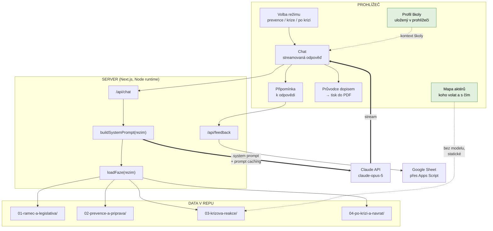
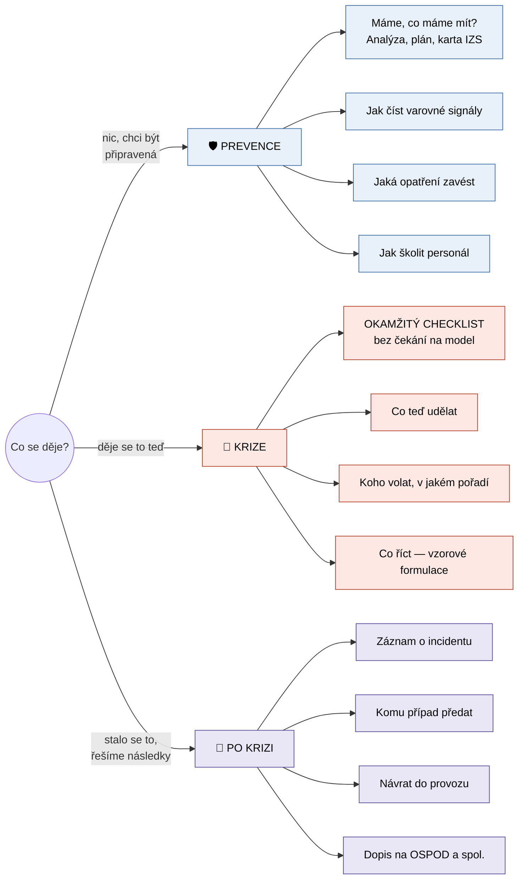
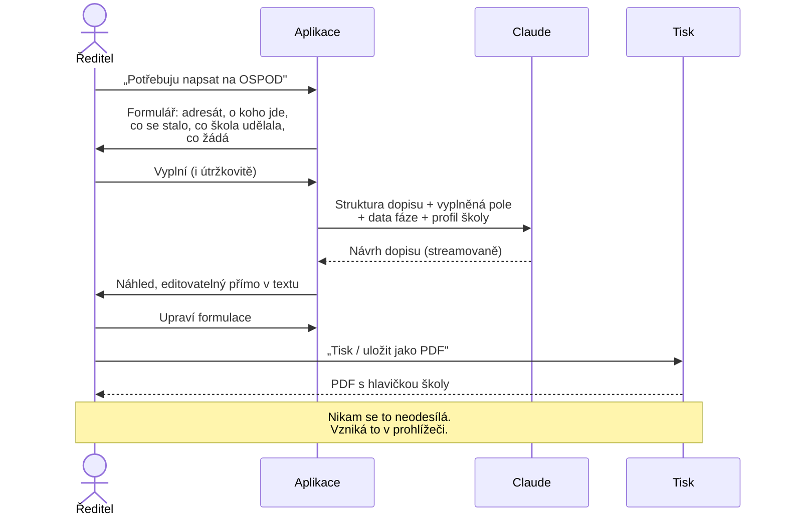
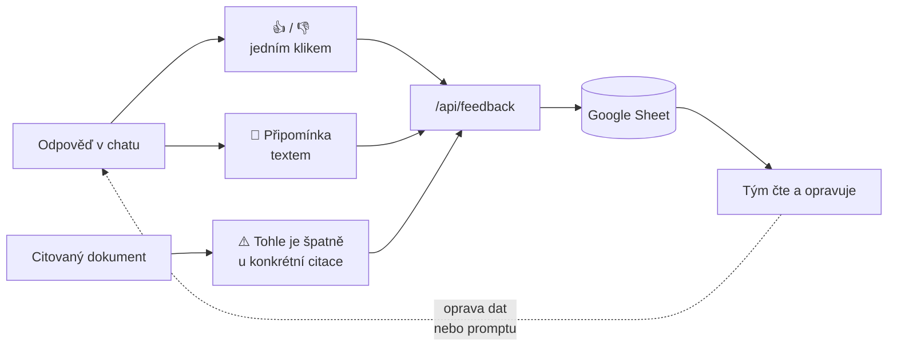

# Návrh chatovací aplikace — Bezpečná škola

Návrh nástroje pro ředitele a vedení škol postaveného nad korpusem
v [`data/`](../data/). Vychází ze stejného vzoru jako
[Katalog podpůrných opatření](https://github.com/aidetemcz/podpurna-opatreni):
Next.js, Anthropic SDK, deterministické vložení dat do promptu, panel
připomínek. Tenhle dokument je **návrh, ne popis hotové věci** — nic z toho
zatím není naimplementované.

---

## 1. Co to má být

Ředitel má na stole 150 stran metodik od pěti různých vydavatelů. Ve chvíli,
kdy je potřebuje, na ně nemá čas. Aplikace má z korpusu udělat **odpověď na
konkrétní otázku konkrétní školy** — a když je potřeba, rovnou i dopis.

**Co to není:** není to tísňová linka a není to právní poradna. Obojí musí být
v UI vidět, ne schované v patičce.

---

## 2. Architektura



**Klíčové rozhodnutí: žádné RAG, žádné embeddingy.** Volba režimu = pevně daný
obsah složky. Korpus je malý (~66 000 tokenů celý, 8–28 000 na fázi), takže se
příslušná fáze vloží do promptu celá a označí se `cache_control`. Je to
levnější, rychlejší a hlavně **předvídatelné** — u bezpečnostních postupů
nechceme, aby vyhledávač někdy nenašel to podstatné.

Složka `01-ramec-a-legislativa/` se přikládá **vždy**, ke každému režimu:
terminologie a legislativa jsou potřeba pořád.

---

## 3. Tři režimy



| Režim | Vložená data | Tokenů | Chování modelu |
| --- | --- | ---: | --- |
| **Prevence** | `01` + `02` | ~41 000 | Ptá se na kontext školy, navrhuje postup, umí vygenerovat osnovu dokumentu |
| **Krize** | `01` + `03` | ~34 000 | Krátké odpovědi, odrážky, žádné úvody. Vždy začíná linkou 158 |
| **Po krizi** | `01` + `04` + KRIT | ~28 000 | Klidný tón, navigace k lidem, příprava dokumentů |

### Krizový režim se chová jinak než chat

Tohle je nejdůležitější věc v celém návrhu. **Když se něco děje, streamovaná
odpověď jazykového modelu je špatné UI.** Ředitel nemá deset vteřin.

Proto krizový režim otevírá **statický checklist**, který se vykreslí okamžitě
a je vytažený přímo z [AMOK 4](../data/03-krizova-reakce/amok-04-okamzita-reakce-na-utok.md)
a [AMOK 9](../data/03-krizova-reakce/amok-09-obecna-doporuceni.md) — žádné volání
API, žádné čekání:

```
┌──────────────────────────────────────────┐
│  📞  158        VOLAT / POSLAT SMS       │  ← velké, první, vždy
├──────────────────────────────────────────┤
│  □ Vyhlásit lockdown / evakuaci          │
│  □ Informovat ostatní zvoleným kanálem   │
│  □ Zamknout, zatemnit, zabarikádovat     │
│  □ Sečíst osoby                          │
│  □ Informovat zřizovatele a zaměstnance  │
└──────────────────────────────────────────┘
       ↓ teprve pod tím
   [ Chat: „popište situaci…" ]
```

Chat je v krizovém režimu **doplněk**, ne hlavní věc.

---

## 4. Průvodce dopisem → PDF

Ředitel potřebuje napsat na OSPOD a neví jak. Aplikace ho provede a vytiskne.



**Šablony dopisů**, které dávají z korpusu smysl:

| Šablona | Komu | Opora v datech |
| --- | --- | --- |
| Oznámení o ohrožení dítěte | OSPOD | [AMOK 1](../data/02-prevence-a-priprava/amok-01-prevence-a-pripravenost.md), [příloha 5](../data/04-po-krizi-a-navrat/priloha-05-evidence-bezpecnostnich-incidentu.md) |
| Postoupení záznamu o incidentu | OSPOD, PČR, SZ | [příloha 5](../data/04-po-krizi-a-navrat/priloha-05-evidence-bezpecnostnich-incidentu.md) — formulář |
| Oznámení podezření ze spáchání TČ | PČR / státní zastupitelství | [příloha 5](../data/04-po-krizi-a-navrat/priloha-05-evidence-bezpecnostnich-incidentu.md) |
| Žádost o spolupráci | PPP / SVP | [AMOK 11](../data/01-ramec-a-legislativa/amok-11-nejcastejsi-dotazy.md) |
| Informace zřizovateli | Zřizovatel | [KRIT](../data/03-krizova-reakce/krit-akutni-komunikace-ve-skolnim-prostredi.md) |
| Dopis rodičům | Rodiče | [KRIT](../data/03-krizova-reakce/krit-akutni-komunikace-ve-skolnim-prostredi.md) — vzorové formulace |

### Proč tisk v prohlížeči a ne generování na serveru

Dopis na OSPOD obsahuje **jméno dítěte a popis jeho situace** — zvláštní
kategorie osobních údajů. Tisk přes `window.print()` a `@media print` stylopis
znamená, že hotový dopis **nikdy neopustí prohlížeč**: neukládá se na server,
neteče do logů, nevzniká soubor, který by někdo musel mazat.

Serverové generování PDF (Puppeteer, `pdf-lib`) by dalo hezčí sazbu, ale
za cenu, že osobní údaje projdou serverem. **Doporučuju tisk v prohlížeči**,
dokud nebude důvod pro opak.

> ⚠️ **I tak platí:** text dopisu jde do Claude API, aby vznikl návrh. To je
> zpracování osobních údajů a musí být pokryté smluvně i v informaci pro
> uživatele. Alternativa pro citlivé případy: nechat model vygenerovat
> **šablonu s prázdnými místy** a jméno dítěte doplnit až v prohlížeči.
> Tohle je rozhodnutí, které je potřeba udělat vědomě.

---

## 5. Mapa aktérů v aplikaci

Obsah je v [`mapa-akteru.md`](mapa-akteru.md). V aplikaci vystupuje dvakrát:

1. **Jako statická obrazovka** — tabulka „kdy, komu, s čím", filtrovatelná podle
   fáze. Vykreslí se bez volání modelu, funguje i offline.
2. **Jako kontext pro model** — každá odpověď, která se dotýká někoho zvenčí,
   má končit konkrétním „komu zavolat".

**Profil školy** doplňuje to, co korpus nemá — místní kontakty. Vyplní se
jednou, drží se v `localStorage` prohlížeče:

```
Název a adresa školy · zřizovatel · počty žáků a zaměstnanců
místní OSPOD · spádová PPP · kontakt na PČR · školní psycholog
```

Slouží ke dvěma věcem: hlavička dopisů a konkretizace odpovědí („zavolejte na
OSPOD Praha 6" místo „zavolejte na OSPOD").

---

## 6. Připomínkování pro testovací fázi

Aplikace se bude testovat s řediteli, takže sbírání zpětné vazby není doplněk,
je to hlavní funkce téhle fáze.



Každá připomínka nese kontext, aby se dala vyhodnotit bez dohadování:

| Pole | Proč |
| --- | --- |
| `rezim` | prevence / krize / po krizi |
| `dotaz` | co uživatel napsal |
| `odpoved` | co model odpověděl |
| `text` | co je podle uživatele špatně |
| `autor` | nepovinné, ať víme koho se doptat |
| `citace` | u které citace to vázlo |
| `verze_dat` | commit hash korpusu |
| `cas` | kdy |

Stejný mechanismus jako v Katalogu podpůrných opatření:
`POST /api/feedback` → webhook Apps Scriptu → Google Sheet. Žádná databáze,
žádné CORS, tým vidí připomínky v tabulce.

**Doporučuju přidat `verze_dat`** — bez něj se po měsíci nepozná, jestli
připomínka platí pro současný korpus, nebo pro ten před opravou.

---

## 7. Technické řešení

Přebírá se stack ověřený na Katalogu podpůrných opatření:

| Vrstva | Volba |
| --- | --- |
| Framework | Next.js 15 (App Router), React 19, TypeScript |
| Model | `claude-opus-5`, konfigurovatelné přes `ANTHROPIC_MODEL` |
| Volání | Oficiální Anthropic SDK, streamovaně |
| Prompt | Deterministické vložení fáze + `cache_control` na velkém bloku |
| Runtime | Node (potřebuje `fs` pro čtení `data/`) |
| Nasazení | Vercel; `outputFileTracingIncludes` přibalí `data/` |
| Připomínky | `FEEDBACK_WEBHOOK_URL` → Apps Script → Sheet |
| PDF | `window.print()` + tiskový stylopis |

Skladba system promptu:

```
[ blok 1 ]  role, tón, pravidla režimu, profil školy       ← malý, mění se
[ blok 2 ]  01-ramec-a-legislativa/ (vždy)                 ← cache_control
[ blok 3 ]  data zvolené fáze                              ← cache_control
```

Bloky 2 a 3 jsou stabilní přes celou konverzaci, takže se čtou z cache.
Volatilní věci (profil školy, čas) patří **až za** poslední cache breakpoint,
jinak se cache při každém tahu zahodí.

### Instrukce, které musí být v promptu

- Vycházej **jen z vložených dokumentů**. Když tam odpověď není, řekni to.
- U každého tvrzení uveď **zdroj** — název dokumentu a části.
- Rozlišuj **`[§ ZÁVAZNÉ]` od `[D DOPORUČENÍ]`**. Nikdy z doporučení nedělej
  povinnost.
- Neříkej, že něco *musí* ze zákona, pokud to tak není označené v datech.
- Každou odpověď o vnějším aktérovi ukonči **konkrétním dalším krokem**.
- V krizovém režimu: krátce, v odrážkách, bez úvodů.

---

## 8. Meze, které je potřeba přiznat

| Mez | Důsledek pro aplikaci |
| --- | --- |
| **Fáze „po krizi" je datově nejslabší** — 2 600 slov proti 15 500 u prevence | Režim musí častěji odpovídat „na tohle data nestačí, obraťte se na…" |
| **Zákon 359/1999 Sb. v korpusu není** | Aplikace nesmí tvrdit, kdy vzniká oznamovací povinnost |
| **Chybí 5 dokumentů, na které korpus odkazuje** | Viz [`provazanost-dat.md`](provazanost-dat.md); doplnit je je nejlevnější způsob, jak aplikaci vylepšit |
| **Korpus je celostátní** | Místní kontakty musí dodat profil školy |
| **Metodiky nejsou právní výklad** | Viditelná doložka, ne v patičce |
| **Dokument KRIT má distribuční doložku** | Vyřešeno souhlasem autorky; při rozšíření týmu ověřit znovu |

---

## 9. Co je potřeba rozhodnout před implementací

1. **Osobní údaje v promptu** — posílat jména dětí do API, nebo generovat
   šablonu s prázdnými místy? (kapitola 4)
2. **Přihlašování** — veřejné, nebo za přihlášením? Ovlivňuje to, jak citlivé
   věci si uživatelé dovolí napsat.
3. **Krizový režim v terénu** — má fungovat offline na mobilu? Statický
   checklist ano; chat ne.
4. **Kdo připomínky vyhodnocuje** a jak rychle se opravy promítnou do dat.
5. **Doplnit chybějící dokumenty** do korpusu před testováním, nebo až po něm?

---

## 10. Návrh postupu

| Fáze | Obsah |
| --- | --- |
| **1. Kostra** | Next.js, tři režimy, chat nad daty, připomínky. Cíl: dát to řediteli do ruky. |
| **2. Testování** | 5–10 ředitelů, sběr připomínek, oprava dat a promptu. |
| **3. Dopisy** | Průvodce dopisem a tisk do PDF, poté co je jasné, co ředitelé opravdu píšou. |
| **4. Doplnění dat** | Chybějící dokumenty, hlavně k fázi po krizi. |
| **5. Profil školy** | Místní kontakty, hlavičky dopisů. |

Průvodce dopisem je záměrně až ve fázi 3 — teprve testování ukáže, které
šablony ředitelé potřebují. Šest šablon z kapitoly 4 je odhad z dat, ne
zjištěná potřeba.
