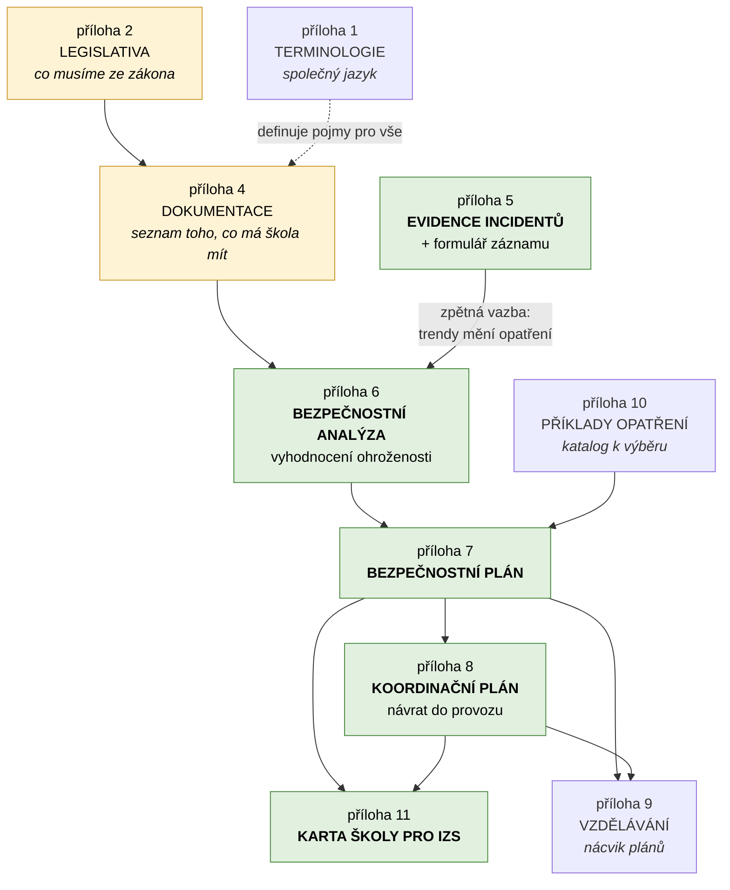
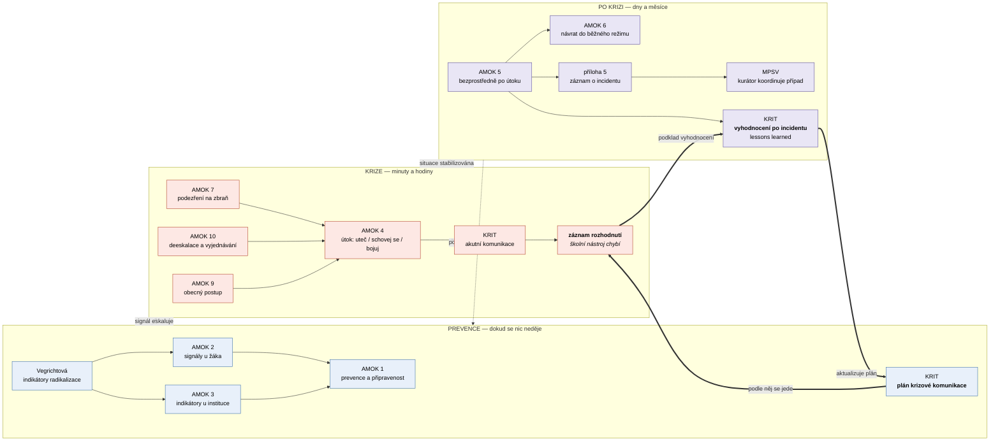
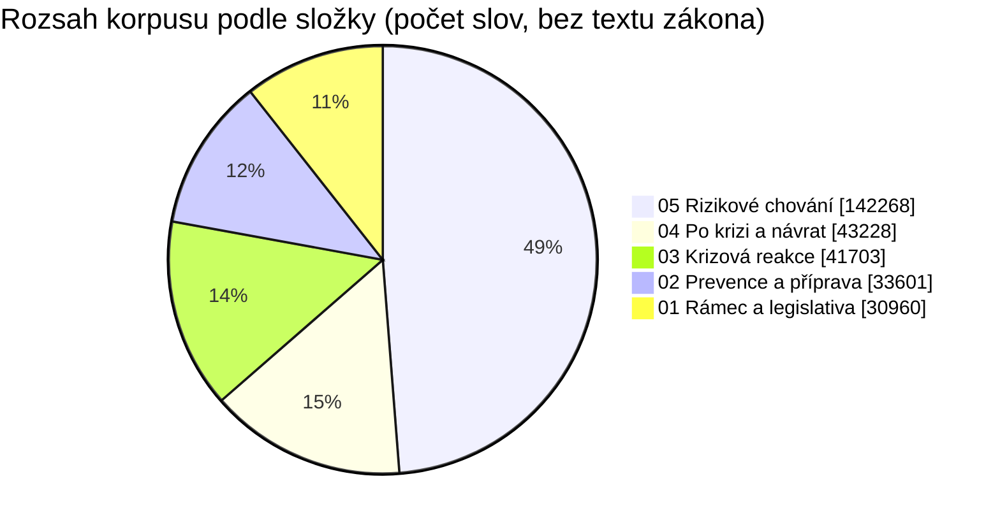

# Provázanost dat — co na co navazuje

Korpus není hromada nezávislých metodik. Dokumenty na sebe **explicitně
odkazují** a tvoří dvě propletené struktury: *dokumentační kaskádu* MŠMT
(co škola vyrábí a v jakém pořadí) a *časovou osu incidentu* (co kdo dělá
a kdy). Tenhle dokument obě ukazuje a končí tím, co v korpusu chybí.

---

## 1. Dokumentační kaskáda MŠMT

Metodika MŠMT má pevné pořadí: nelze psát plán, dokud není analýza. Tohle není
naše interpretace — příloha č. 7 to říká doslova: *„Ke zpracování
bezpečnostního plánu se přistupuje ve chvíli, kdy je zpracována bezpečnostní
analýza včetně vyhodnocení ohroženosti."*

**Jak to číst:** analýza je vstup do všeho. Bez ní je plán jen opsaná šablona.
Evidence incidentů uzavírá smyčku zpátky do analýzy — příloha č. 5 to
zdůvodňuje tím, že *„její analýza může poskytnout cenné informace o trendech
a přizpůsobit bezpečnostní opatření"*.

Karta školy pro IZS je jediný dokument, který **čte někdo zvenčí** — velitel
zásahu. Proto stojí na konci kaskády: shrnuje plán i koordinační plán do
podoby, kterou lze přečíst za jízdy.

---

## 2. Časová osa incidentu

Druhá struktura jde napříč vydavateli. MŠMT říká, *co mít připravené*; policejní
doporučení AMOK, *co dělat*; KRIT, *co říkat*; MPSV, *komu případ předat*.

Přerušovaná šipka zpět do prevence je stejná smyčka jako v kaskádě — jen viděná
z druhé strany.

Silné šipky vyznačují **komunikační páteř**, kterou přinesly metodiky KRIT
a která prochází všemi třemi fázemi: plán krizové komunikace se sestaví předem,
v krizi se podle něj jede a rozhodnutí se chronologicky zapisují, po odeznění je
záznam podkladem pro vyhodnocení a to zpětně mění plán.

**Prostřední článek ale pro školu zatím nemá nástroj.** KRIT má
[Rodnou kartu incidentu](../data/03-krizova-reakce/Rodn%C3%A1%20karta%20incidentu%20%28RKI%29.md),
jenže ta je jejich interní koordinační nástroj napříč IZS, policií, samosprávou
a ministerstvy — ne dokument ředitele. Školní obdoba se připravuje.

> **Poznámka k zařazení.** Příručka KRIT *Akutní komunikace ve školním prostředí*
> leží v `03-krizova-reakce/`, ale celá jedna její třetina je prevence — právě
> tvorba komunikačního plánu, cvičení a příprava zaměstnanců. Zařadili jsme ji
> podle názvu, ne podle obsahu. Aplikace ji proto načítá i v režimu prevence,
> viz [`navrh-aplikace.md`](navrh-aplikace.md), kapitola 3.

---

## 3. Pro koho je co psané

Než se podíváme na pokrytí, jedna věc, která se snadno přehlédne: **korpus není
celý psaný pro školu.**

| Adresát | Dokumenty |
| --- | --- |
| **Škola** | Celá metodika MŠMT, doporučení AMOK, MPSV, Vegrichtová — a z KRIT **jediný** dokument: [příručka pro školní prostředí](../data/03-krizova-reakce/krit-akutni-komunikace-ve-skolnim-prostredi.md) *(„Jste ve vedoucí pozici ve školním prostředí…")* |
| **Starostové a obce** | 20 karet pro starosty, Varování před hrozícím nebezpečím, Zapojení NNO a dobrovolníků |
| **Instituce veřejné správy / KRIT** | Rodná karta incidentu, FOIPS, Principy koordinace, Systém včasného varování, Akutní komunikace, Holding lines, Sociálně citlivá témata, Vyhodnocení po incidentu |

Materiály z druhé a třetí skupiny jsou pro školu **použitelné, ale ne adresované**.
Přenáší se z nich *postup*, ne *pokyn*. Pro aplikaci z toho plyne konkrétní
pravidlo: model nesmí ředitele posílat k nástroji, který není jeho — viz
[`navrh-aplikace.md`](navrh-aplikace.md), kapitola 8.

---

## 4. Co korpus pokrývá

| Otázka, kterou si ředitel klade | Kde je odpověď | Síla pokrytí |
| --- | --- | --- |
| Co musím mít ze zákona? | příloha 2, příloha 4 | **silné** — s rozlišením závazné/doporučené |
| Jak vyhodnotím rizika naší školy? | příloha 6 | střední — postup ano, hotové příklady ne |
| Jaká opatření mám zavést? | příloha 10 | **silné** — katalog režimových, technických, ostatních |
| Jak poznám ohroženého žáka? | AMOK 2, Vegrichtová | **silné** — indikátory i praktické příklady |
| Co dělám při útoku? | AMOK 4, 7, 9, 10 | **silné** — konkrétní, akční, krátké |
| Co říct rodičům a médiím? | KRIT | **silné** — vzorové formulace i pořadí adresátů |
| Koho a kdy informovat? | příloha 11, KRIT, AMOK 12 | střední — roztroušené, viz [mapa aktérů](mapa-akteru.md) |
| Jak incident zaznamenat? | příloha 5 + formulář | **silné** |
| Jak se vrátit do provozu? | příloha 8, AMOK 6 | střední |
| Jak se postarat o zasažené? | Škola a neštěstí, AMOK 6, MPSV | **silné** — psychosociální pomoc, návodné postupy, právní minimum |
| Jak poznat a řešit šikanu, návykové látky, sebepoškozování…? | 05-rizikove-chovani, 22 příloh | **silné** — ke každému typu chování prevence i intervence |
| Co napsat na OSPOD nebo na policii? | 05, šablony k příloze 5 | **silné** — úřední šablony včetně polí |
| Co s žákem se sebevražednými myšlenkami? | příloha 24 a její karty | **silné** — postup, rozhovor, krizový plán pro pozůstalou třídu |
| Co a kdy komunikovat ven? | KRIT — FOIPS, holding lines, RKI | **silné** — přibylo s metodikami KRIT |
| Co dělá OSPOD a za jakých podmínek? | zákon 359/1999, ČÁST TŘETÍ | **silné** — plné znění zákona |
| Co při jiné mimořádné události než útoku? | KRIT, karty pro starosty | **silné** — 20 typů událostí |
| Jak sestavit plán krizové komunikace? | KRIT — příručka pro školy | **silné** |
| Jak zaznamenat rozhodnutí v průběhu krize? | KRIT — RKI (jen jako předloha) | **slabé pro školu** — struktura ano, školní nástroj ne |
| Co si z incidentu odnést? | KRIT — vyhodnocení po incidentu | **silné** — osnova i kontrolní otázky |
| Jak školit personál? | příloha 9 | **silné** — včetně nároků na lektory |

---

## 5. Mezery — na co korpus odkazuje, ale neobsahuje to

Tohle nejsou domněnky. Jsou to dokumenty, které **naše vlastní data jmenují**
jako zdroj, ale samy v korpusu nejsou.

> **Doplněno v září 2026.** Seznam se skoro celý vyprázdnil. Doplněné dokumenty
> jsou v tabulce níže odškrtnuté; z původních sedmi zbývá jediný, a ten
> neexistuje zatím nikde. Přibyly k tomu i věci, které na seznamu nebyly:
> celé Metodické doporučení k primární prevenci se všemi přílohami
> ([`05-rizikove-chovani/`](../data/05-rizikove-chovani/)), Základy ochrany
> měkkých cílů, koordinační plány MV, spolupráce škol s PČR a záškoláctví.
> Dřív doplněný byl zákon č. 359/1999 Sb. a metodiky KRIT.

| Dokument | Odkud se na něj odkazuje | Stav |
| --- | --- | --- |
| **Škola a neštěstí: Jsme připraveni!** (MŠMT, 2023) | příloha 3, příloha 8 a dalších | ✅ [`04/skola-a-nestesti-jsme-pripraveni.md`](../data/04-po-krizi-a-navrat/skola-a-nestesti-jsme-pripraveni.md) — 84 stran |
| **Metodické doporučení k primární prevenci**, zejm. **příloha č. 14** | příloha 1 (u pojmů *plán sekundární* a *terciární intervence*) | ✅ [`05-rizikove-chovani/`](../data/05-rizikove-chovani/) — úvodní část a 22 příloh, ne jen čtrnáctá |
| **Vyhodnocení ohroženosti měkkého cíle** (MV) | příloha 6 | ✅ [`02/mv-vyhodnoceni-ohrozenosti-mekkeho-cile.md`](../data/02-prevence-a-priprava/mv-vyhodnoceni-ohrozenosti-mekkeho-cile.md) — vydání duben 2025 |
| **Bezpečnostní plán měkkého cíle** (MV) | příloha 7 | ✅ [`02/mv-bezpecnostni-plan-mekkeho-cile.md`](../data/02-prevence-a-priprava/mv-bezpecnostni-plan-mekkeho-cile.md) — 2. upravené vydání, duben 2025 |
| **Metodika koordinace měkkého cíle pro fázi po bezpečnostním incidentu** (MV) | příloha 8 | ✅ [`04/mv-metodika-koordinace-po-zavaznem-incidentu.md`](../data/04-po-krizi-a-navrat/mv-metodika-koordinace-po-zavaznem-incidentu.md) — vydání duben 2025 |
| **Metodický pokyn k zajištění BOZ** (MŠMT, č.j. 37014/2005) | příloha 3 | ✅ [`01/msmt-pokyn-bozp-37014-2005.md`](../data/01-ramec-a-legislativa/msmt-pokyn-bozp-37014-2005.md) |
| **Školní obdoba Rodné karty incidentu** | — chybí i ve zdrojích | ❌ **stále chybí.** Nástroj, kterým by ředitel vedl chronologický záznam rozhodnutí. KRIT ji připravuje. |

> **Pozor na vydání.** Metodika MŠMT odkazuje na verze měkkých cílů z let
> 2018 a 2019. MV je v dubnu 2025 vydalo znovu a přepracované; v korpusu jsou
> **nová vydání**. Odkazy v příloze č. 3 tedy míří na starší text, než jaký
> tu leží.

### Co v korpusu chybí i po doplnění

| Chybí | Proč to víme | Co by doplnilo |
| --- | --- | --- |
| **Školní obdoba Rodné karty incidentu** | vlastní analýza komunikační páteře, kapitola 2 | Prostřední článek: čím ředitel v krizi zapisuje rozhodnutí. |
| **Příloha č. 24-10 — Co dělat kdy: míra rizika sebevraždy a vhodné reakce pedagoga** | příloha č. 24 ji jmenuje ve výčtu svých příloh | Zdrojové PDF je grafika bez textové vrstvy, převod z něj nedostane nic. Chce to OCR nebo text od vydavatele. |
| **Přílohy č. 11 a 20** Metodického doporučení k primární prevenci | číslování řady 1–24 | Nebyly mezi zdroji; nevíme, zda existují. |
| **Příručka pro školy — týrané, zneužívané, zanedbávané dítě** | příloha č. 5 na ni navazuje | Nahrané PDF obsahuje jen titulní stranu. Obsah z velké části pokrývá příloha č. 5, ale příručka sama v korpusu není. |
| **Metodický pokyn k prevenci a řešení šikany** (č.j. MSMT-21149/2016) | příloha č. 6 z něj z větší části vychází | Příloha 6 shrnuje to podstatné, ale samotný pokyn je jinde. |

### Nejvýraznější nepoměr

**Nepoměr se obrátil.** Fáze „po krizi" byla nejtenčí částí korpusu — 5 300 slov
proti 41 100 u krizové reakce. Dnes má 43 200 slov a je se zbytkem časové osy
srovnaná; udělaly to hlavně *Škola a neštěstí* (29 000 slov) a metodika
koordinace MV. Otázka „jak se postarat o zasažené dítě tři měsíce po incidentu"
konečně odpověď má.

Nový nepoměr je jinde: **složka `05` je sama větší než celá časová osa
dohromady**. To není chyba dat, je to důsledek toho, že MŠMT ke každému typu
rizikového chování vydalo samostatnou přílohu. Pro aplikaci z toho plyne, že
`05` se musí zpřístupňovat přes rejstřík a dočítání, ne vkládáním do promptu —
viz [`navrh-aplikace.md`](navrh-aplikace.md), kapitola 2, jejíž čísla je
potřeba přepočítat.
