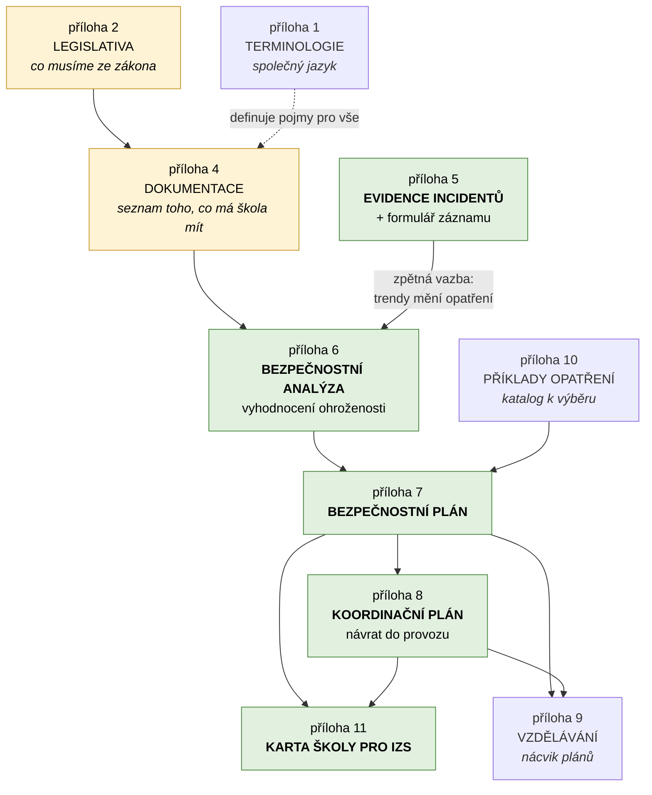
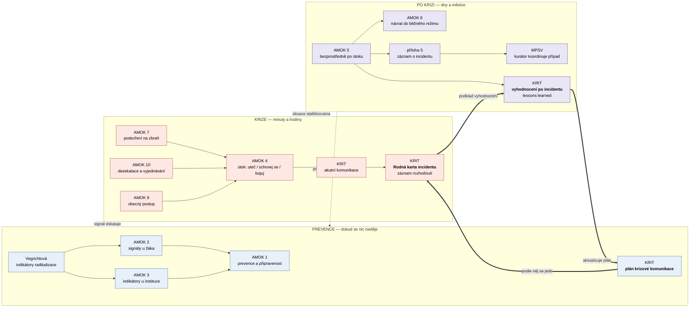
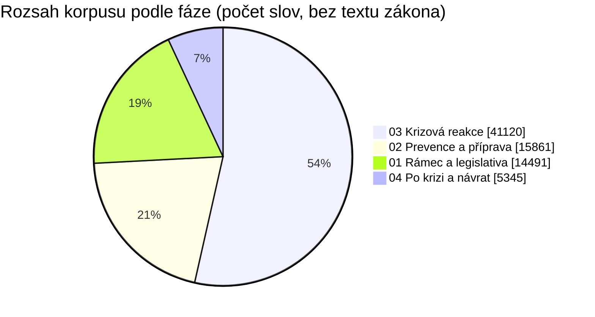

# Provázanost dat — co na co navazuje

Korpus není hromada nezávislých metodik. Dokumenty na sebe **explicitně
odkazují** a tvoří dvě propletené struktury: *dokumentační kaskádu* MŠMT
(co škola vyrábí a v jakém pořadí) a *časovou osu incidentu* (co kdo dělá
a kdy). Tenhle dokument obě ukazuje a končí tím, co v korpusu chybí.

---

## 1. Dokumentační kaskáda MŠMT

Metodika MŠMT má pevné pořadí: nelze psát plán, dokud není analýza. Tohle není
naše interpretace — příloha č. 7 to říká doslova: *„Ke zpracování
bezpečnostního plánu se přistupuje ve chvíli, kdy je zpracována bezpečnostní
analýza včetně vyhodnocení ohroženosti."*

**Jak to číst:** analýza je vstup do všeho. Bez ní je plán jen opsaná šablona.
Evidence incidentů uzavírá smyčku zpátky do analýzy — příloha č. 5 to
zdůvodňuje tím, že *„její analýza může poskytnout cenné informace o trendech
a přizpůsobit bezpečnostní opatření"*.

Karta školy pro IZS je jediný dokument, který **čte někdo zvenčí** — velitel
zásahu. Proto stojí na konci kaskády: shrnuje plán i koordinační plán do
podoby, kterou lze přečíst za jízdy.

---

## 2. Časová osa incidentu

Druhá struktura jde napříč vydavateli. MŠMT říká, *co mít připravené*; policejní
doporučení AMOK, *co dělat*; KRIT, *co říkat*; MPSV, *komu případ předat*.

Přerušovaná šipka zpět do prevence je stejná smyčka jako v kaskádě — jen viděná
z druhé strany.

Silné šipky vyznačují **komunikační páteř**, kterou přinesly metodiky KRIT
a která prochází všemi třemi fázemi: plán krizové komunikace se sestaví předem,
v krizi se podle něj jede a rozhodnutí se chronologicky zapisují do Rodné karty
incidentu, po odeznění je karta podkladem pro vyhodnocení a to zpětně mění plán.

> **Poznámka k zařazení.** Příručka KRIT *Akutní komunikace ve školním prostředí*
> leží v `03-krizova-reakce/`, ale celá jedna její třetina je prevence — právě
> tvorba komunikačního plánu, cvičení a příprava zaměstnanců. Zařadili jsme ji
> podle názvu, ne podle obsahu. Aplikace ji proto načítá i v režimu prevence,
> viz [`navrh-aplikace.md`](navrh-aplikace.md), kapitola 3.

---

## 3. Co korpus pokrývá

| Otázka, kterou si ředitel klade | Kde je odpověď | Síla pokrytí |
| --- | --- | --- |
| Co musím mít ze zákona? | příloha 2, příloha 4 | **silné** — s rozlišením závazné/doporučené |
| Jak vyhodnotím rizika naší školy? | příloha 6 | střední — postup ano, hotové příklady ne |
| Jaká opatření mám zavést? | příloha 10 | **silné** — katalog režimových, technických, ostatních |
| Jak poznám ohroženého žáka? | AMOK 2, Vegrichtová | **silné** — indikátory i praktické příklady |
| Co dělám při útoku? | AMOK 4, 7, 9, 10 | **silné** — konkrétní, akční, krátké |
| Co říct rodičům a médiím? | KRIT | **silné** — vzorové formulace i pořadí adresátů |
| Koho a kdy informovat? | příloha 11, KRIT, AMOK 12 | střední — roztroušené, viz [mapa aktérů](mapa-akteru.md) |
| Jak incident zaznamenat? | příloha 5 + formulář | **silné** |
| Jak se vrátit do provozu? | příloha 8, AMOK 6 | střední |
| Jak se postarat o zasažené? | AMOK 6, MPSV | **slabé** — viz mezery |
| Co a kdy komunikovat ven? | KRIT — FOIPS, holding lines, RKI | **silné** — přibylo s metodikami KRIT |
| Co dělá OSPOD a za jakých podmínek? | zákon 359/1999, ČÁST TŘETÍ | **silné** — plné znění zákona |
| Co při jiné mimořádné události než útoku? | KRIT, karty pro starosty | **silné** — 20 typů událostí |
| Jak sestavit plán krizové komunikace? | KRIT — příručka pro školy | **silné** |
| Jak zaznamenat rozhodnutí v průběhu krize? | KRIT — Rodná karta incidentu | **silné** — struktura i pravidla zápisu |
| Co si z incidentu odnést? | KRIT — vyhodnocení po incidentu | **silné** — osnova i kontrolní otázky |
| Jak školit personál? | příloha 9 | **silné** — včetně nároků na lektory |

---

## 4. Mezery — na co korpus odkazuje, ale neobsahuje to

Tohle nejsou domněnky. Jsou to dokumenty, které **naše vlastní data jmenují**
jako zdroj, ale samy v korpusu nejsou.

> **Doplněno:** zákon č. 359/1999 Sb., o sociálně-právní ochraně dětí, na tomto
> seznamu původně byl. Dnes je v korpusu celý
> ([`zakon-359-1999/`](../data/01-ramec-a-legislativa/zakon-359-1999/)),
> stejně jako metodiky KRIT ke krizové komunikaci.

| Chybějící dokument | Odkud se na něj odkazuje | Co by doplnil |
| --- | --- | --- |
| **Škola a neštěstí: Jsme připraveni!** (MŠMT, 2023) | příloha 3, příloha 8 a dalších | Nejcitovanější chybějící zdroj. Práce se zasaženými, následná péče. |
| **Metodické doporučení k primární prevenci rizikového chování**, zejm. **příloha č. 14** (MŠMT, č.j. 21291/2010-28) | příloha 1 (u pojmů *plán sekundární* a *terciární intervence*) | Terminologie tyto pojmy definuje, ale postup samotný je jinde. |
| **Vyhodnocení ohroženosti měkkého cíle** (MV) | příloha 6 | Detailní metodika k tomu, co příloha 6 jen rámuje. |
| **Bezpečnostní plán měkkého cíle** (MV) | příloha 7 | Totéž pro plán. |
| **Metodika koordinace měkkého cíle pro fázi po bezpečnostním incidentu** (MV) | příloha 8 | Právě ta nejslabší fáze. |
| **Metodický pokyn k zajištění BOZ** (MŠMT, č.j. 37014/2005) | příloha 3 | Průnik s BOZP. |

### Nejvýraznější nepoměr

**Fáze „po krizi" zůstává nejtenčí** — 5 300 slov proti 41 100 u krizové
reakce. Přitom trvá nejdéle (měsíce) a škola v ní potřebuje nejvíc podpory.
Dva z chybějících dokumentů v tabulce výše míří přesně sem.

Doplnění metodik KRIT nepoměr zmenšilo, ale neodstranilo: KRIT přinesl hlavně
*komunikaci*, ne *následnou péči*. Otázka „jak se postarat o zasažené dítě
tři měsíce po incidentu" v korpusu odpověď pořád nemá.

Pro návrh aplikace z toho plyne konkrétní důsledek: **režim „po krizi" bude mít
nejslabší datovou oporu** a musí to přiznat — spíš navigovat k lidem (kurátor,
krizová intervence, zřizovatel) než předstírat, že má postup. Viz
[`navrh-aplikace.md`](navrh-aplikace.md), kapitola o mezích.
